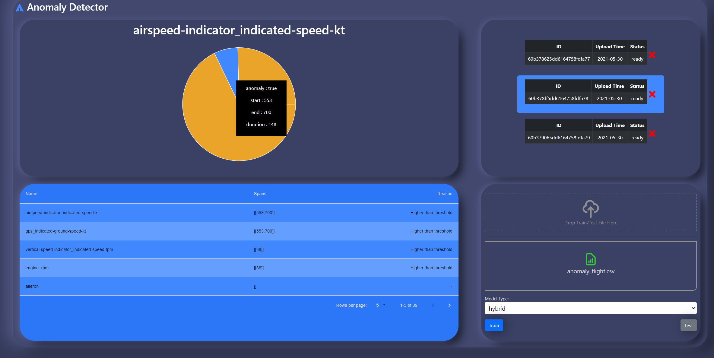

# FlightSimulatorWebApp

## Main Objectives:
1. Building a web-application for anomaly detection algortihms from previous semester.
2. Implementing a REST API for the web-app.
3. Creating a GUI for the web-app.
4. using data base for storing and getting flight data.


## Summary

The FlightSimulatorWebApp is a web-app application for analyzing a given flight report (in the form of a csv file uploaded). 
It will present the anomalies of a chosen flight paramater graphically in a table and a graph for easy inspection.

## Application features:

1. drag-and-drop area for uploading test and train files of a flight
2. multiple flight support. (adding and deleting)
3. anomalies table of a chosen flight model
4. visuallization of the anomalies in a graph.
5. REST API for http requests from the server.



## Folder Structure

```
.Milestone_2
├── client              # UI of the web application (View part of the MVC architecture)
|   ├── public          # contain the public files such as the index.html, the main page.
|   ├── src             # UI implementation folder.
|   |   ├── api         # HTTP requests implemantation files.	
|   |   ├── components	# The different UI componenets in the web app.
|   |   |   ├──...      # The UI componenets implementations.
|   |   ├── utils       # Holds helper logic files.
├── Server
|   ├── controller      # controller part of the MVC architecture.
|   |   ├── anomaly     # implements the get http request for anomaly
|   |   ├── model       # implements the get http for model 
|   |   ├── models      # implements the get http for models
|   ├── lib             # anomaly detection logic.
|   ├── model           # the model part of the MVC architecture whice communicates with the data base.
```

## Requirements:
* Chrome web browser
* Visual Studio Code IDE
* Node.js 14.16.1 (or higher)
* npm 6.14.12 (or higher)

## Compiling and running
1. Clone/download this repo.
2. open the folder in VS-code IDE.
3. open a local terminal and naviagte to the "client" directory and enter "npm install" 
4. navigate to the "Server" directory and enter "npm install"
5. enter "npm start" to run the server.
6. open another terminal, navigate to the "client" directory and enter "npm start" to lunch the web app at local host.

stages 3 and 4 will install the different requirements of the UI and the server tools being used. (react requirments, express ...)

## Additional Links
- [Project's UML  diagram.](https://github.com/Eli-s-Dream-TEam/Milestone_2/blob/main/UMLDiagram.pdf)
- [Short instructional video about the project.](https://www.youtube.com/watch?v=Rtib_R_Ls4Y)
